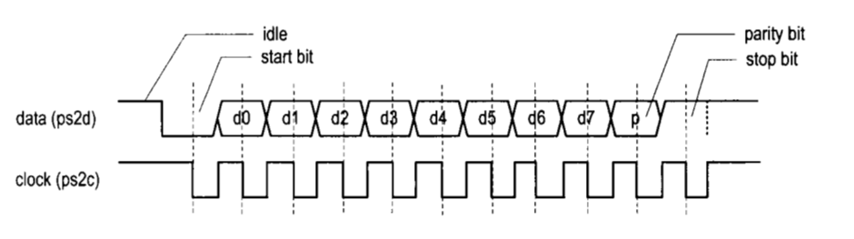
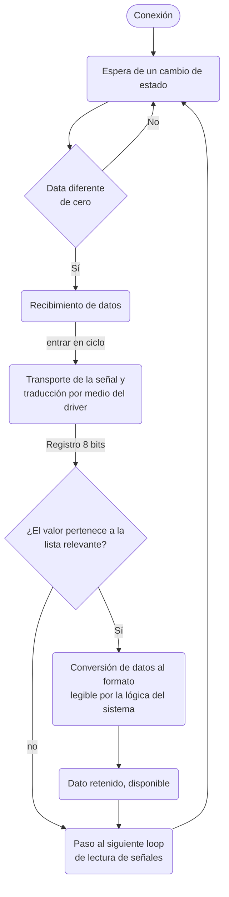

# PS/2 Keyboard

## Responsables

| | |
| :--- | :--- |
| **Ivan Felipe Maluche Suarez** | |
| **Kevin Javier Gonzalez Luna** | |
| **Santiago Guillen** | |
| **Felipe Hortua** | |

## Protocolo

El puerto PS2 está compuesto por dos cables. Hay un cable para datos, cuya transferencia es en serie. El otro cable se emplea para la información del reloj. Este último permite especificar si los datos son válidos y si se pueden recuperar. La información es transmitida como un "paquete" de 11 bits, el cual posee 1 bit de inicio, 8 bits de datos, un bit de paridad impar y finalmente un bit de parada

## Flujo de funcionamiento

Ver diagrama elaborado en draw.io

## Créditos

La documentación y el diseño base de esta plantilla se encuentran en el
repositorio [digital_UN](https://github.com/cicamargoba/digital_UN/tree/main/2026_1),
propiedad de [@cicamargo](https://github.com/cicamargoba).
