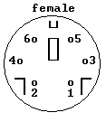
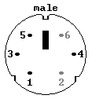
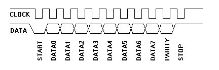
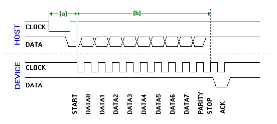
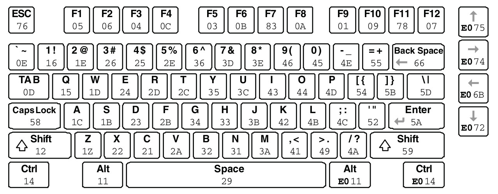
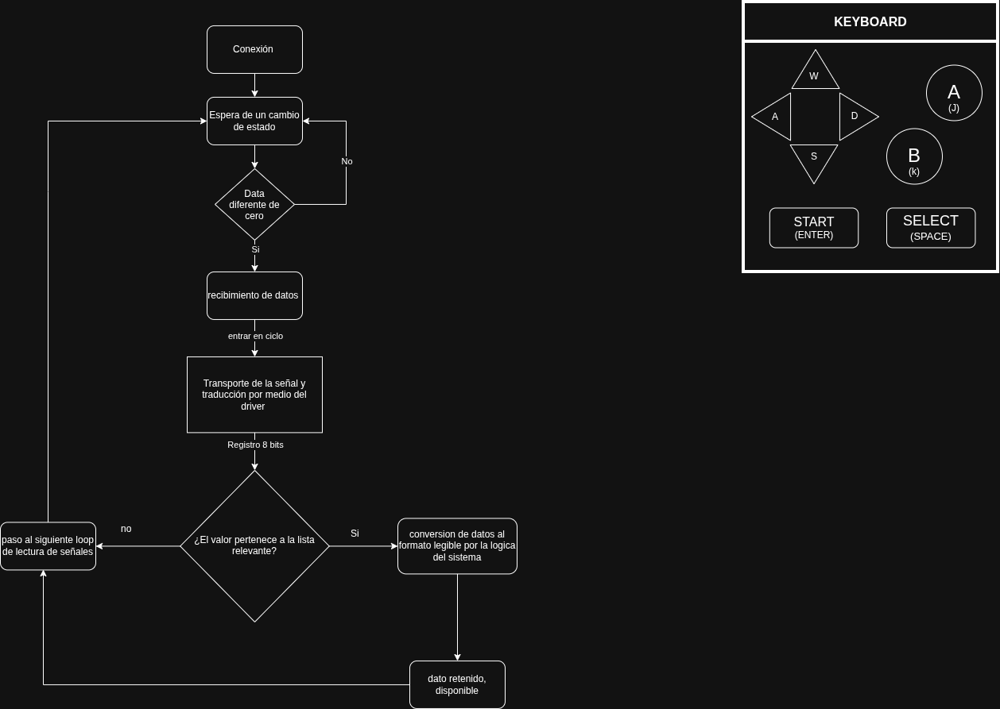
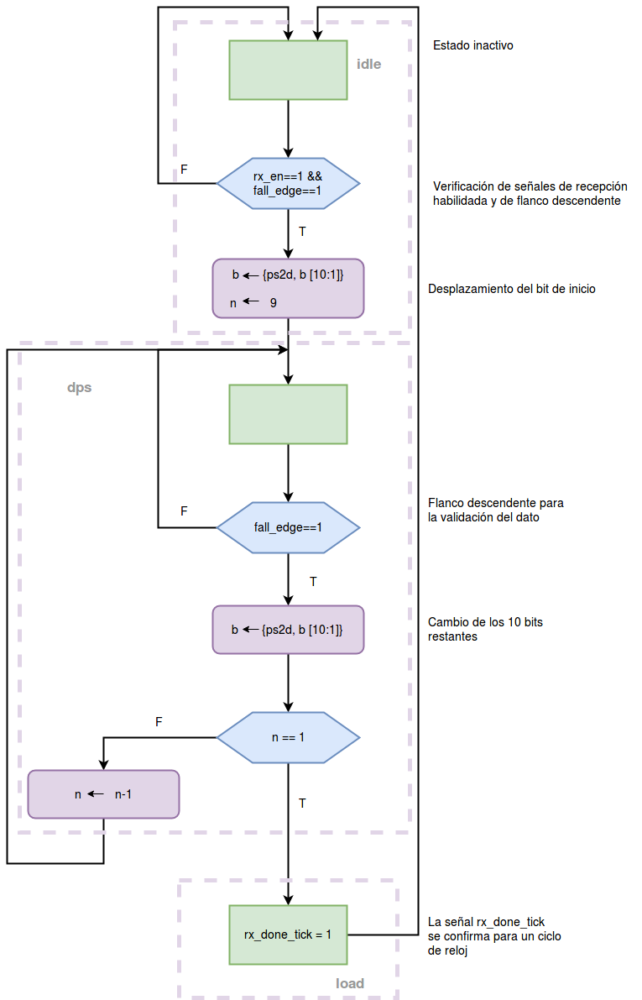

# PS/2 Keyboard

## Responsables

| | 
| :--- | 
| **Ivan Felipe Maluche Suarez** | 
| **Kevin Javier Gonzalez Luna** | 
| **Santiago Guillen** | 
| **Felipe Hortua** | 

---

## Protocolo

PS/2 es una interfaz serial **síncrona, bidireccional y half-duplex (** entre un **dispositivo** (el teclado) y un **host** (en este proyecto, la FPGA).

- *Host*: quien recibe las teclas y puede enviar comandos. *Dispositivo*: el teclado. El dispositivo **siempre** genera el reloj; el host tiene el control final del bus.

- *half-duplex*: Solo envia o recibe, nunca ambas cosas.
- *Bidireccional*: La comunicacion puede ser de teclado a host o de host a teclado.
### Interfaz física

El puerto PS/2 usa dos líneas de señal: **DATA** (datos en serie) y **CLK** (reloj, indica cuándo el dato es válido y puede leerse), más alimentación y tierra.

<table align="center">
  <tr>
    <td align="center">
      
    </td>
    <td align="center">
      
    </td>
    <td>
      <table>
        <tr><th>Pin</th><th>Función</th></tr>
        <tr><td>1</td><td>Data</td></tr>
        <tr><td>2</td><td>Reservado</td></tr>
        <tr><td>3</td><td>GND</td></tr>
        <tr><td>4</td><td>+5 V</td></tr>
        <tr><td>5</td><td>Clock</td></tr>
        <tr><td>6</td><td>Reservado</td></tr>
      </table>
    </td>

  </tr>
</table>

<strong>Reglas generales del protocolo</strong>

<ul>
  <li>Al presionarse una tecla se recibe el paquete de bits que la representan desde el microcontrolador propio del teclado, llegando directamente a DATA </li>
  <li>El teclado siempre genera el reloj, incluso cuando el host es quien envía datos.</li>
  <li>El host puede bloquear la comunicación en cualquier momento bajando CLK al menos <strong>100 µs</strong>.</li>
  <li>Si el host bloquea antes del 11.º pulso de reloj, el teclado aborta y <strong>retransmite todo el bloque</strong> cuando el host libere CLK.</li>
  <li>Cada byte viaja en una trama de 11 bits (12 si va del host al teclado).</li>
</ul>

## La trama

### Formato

Cada byte se envía en una trama serial con **1 bit de inicio, 8 bits de datos (bit menos significativo primero y mas significativo ultimo), 1 bit de paridad impar y 1 bit de parada**.

| Bit | Función | Valor |
| :---: | :--- | :--- |
| 1 | Start | Siempre `0` |
| 2 | D0 (LSB) | Dato |
| 3 | D1 | Dato |
| 4 | D2 | Dato |
| 5 | D3 | Dato |
| 6 | D4 | Dato |
| 7 | D5 | Dato |
| 8 | D6 | Dato |
| 9 | D7 (MSB) | Dato |
| 10 | Paridad | Paridad impar |
| 11 | Stop | Siempre `1` |
| 12 | ACK | Solo en host → teclado: el teclado baja DATA para confirmar |

### Paridad par/impar

La paridad es una convencion elegida por nostros, los 8 bits de datos mas el bit de paridad deben sumar siempre un número par o impar de unos, esto segun la convencion elegida.

Quien recibe debe verificar la paridad. Si es incorrecta, el teclado responde como si hubiera recibido un comando inválido (pide reenvío con `FE`).
### Manejo de bloqueos
En caso de que el host bloquee el reloj (clock ≥ 100 µs ) el teclado guardara el bytes en un buffer de <strong>16 bytes</strong>. Si se llena, las teclas nuevas se ignoran.

Temporización

| Parámetro | Valor |
| :--- | :--- |
| Frecuencia de reloj | 10 – 16.7 kHz |
| CLK en alto | 30 – 50 µs |
| CLK en bajo | 30 – 50 µs |
| Cambio de DATA respecto al flanco de subida de CLK | ≥ 5 µs después |
| Cambio de DATA respecto al flanco de bajada de CLK | entre 5 y 25 µs antes |
| CLK alto continuo antes de que el teclado transmita | ≥ 50 µs |

Para diseñar o emular un dispositivo/host, el dato se modifica o muestrea hacia la **mitad de cada celda**, unos 15–25 µs después de la transición de reloj correspondiente.

### Teclado → Host

  

El teclado inicia y controla toda la transmisión:

1. Verifica que CLK esté en alto (si no, el host está bloqueando y el teclado guarda el dato).
2. Espera que CLK lleve al menos 50 µs en alto.
3. Pone el bit de inicio (`0`) en DATA y genera los pulsos de reloj.
4. Cada bit se coloca en DATA con CLK en alto y **el host lo lee en el flanco de bajada de CLK**.
5. Tras 11 pulsos (start, 8 datos, paridad, stop) el bus vuelve a idle.

| Ciclo de reloj | 1 | 2 – 9 | 10 | 11 |
| :--- | :---: | :---: | :---: | :---: |
| Bit en DATA | Start (0) | D0 … D7 | Paridad | Stop (1) |

### Host → Teclado

  

El teclado sigue generando el reloj, pero el host es quien pone los datos:

1. El host baja **CLK** al menos 100 µs (inhibe).
2. El host baja **DATA** (start bit / request-to-send).
3. El host **suelta CLK**.
4. El teclado detecta la solicitud (la revisa en intervalos no mayores a 10 ms) y empieza a generar reloj.
5. El host coloca cada bit de DATA **mientras CLK está en bajo**; el teclado lo lee **en el flanco de subida** (al revés que en teclado → host).
6. Se envían los 8 bits de datos (LSB primero) y el bit de paridad.
7. El host **suelta DATA** (stop bit = `1`).
8. El teclado confirma con el **bit ACK**: baja DATA y genera un último pulso de reloj.
9. El teclado suelta DATA y CLK; el bus vuelve a idle.

Si el host no suelta DATA tras el 11.º pulso, el teclado sigue generando pulsos hasta que lo haga y luego reporta un error. El host puede abortar antes del 11.º pulso bajando CLK ≥ 100 µs.

**Límites de tiempo que el host debe vigilar:**

| Evento | Tiempo máximo |
| :--- | :---: |
| Que el teclado empiece a generar reloj tras la solicitud | 15 ms |
| Duración de todo el paquete | 2 ms |
| Respuesta del teclado tras soltar CLK (si el comando la requiere) | 20 ms |

Si no se cumple alguno, el host debe generar un error.

---

## Que envía el teclado al host

### Codigos de tecla (scan codes, set 2)

El set 2 es el conjunto por defecto. El teclado envía uno o más bytes cada vez que una tecla se **presiona**, se **mantiene** o se **suelta**.

| Evento | Qué envía | Ejemplo con la tecla A (`1C`) |
| :--- | :--- | :--- |
| Presionar (*make*) | Código de la tecla | `1C` |
| Mantener presionada | El código *make* se repite periódicamente | `1C 1C 1C …` |
| Soltar (*break*) | `F0` seguido del código de la tecla | `F0 1C` |
| Tecla extendida, presionar | `E0` seguido del código | flecha ↑: `E0 75` |
| Tecla extendida, soltar | `E0 F0` seguido del código | flecha ↑: `E0 F0 75` |

**Combinaciones.** Cada tecla genera su propia secuencia. Por ejemplo, Shift izquierdo + A presionadas y soltadas en orden inverso:

`12` (Shift ↓) · `1C` (A ↓) · `F0 1C` (A ↑) · `F0 12` (Shift ↑)

El driver debe recibir byte por byte y decidir, según el prefijo (`E0`, `F0`), si el siguiente código es make, break o extendido.

### Tabla de códigos (set 2)

  

**Teclas extendidas (prefijo `E0`)**

| Tecla | Make | Break |
| :--- | :---: | :---: |
| ↑ | `E0 75` | `E0 F0 75` |
| ↓ | `E0 72` | `E0 F0 72` |
| ← | `E0 6B` | `E0 F0 6B` |
| → | `E0 74` | `E0 F0 74` |
| Insert | `E0 70` | `E0 F0 70` |
| Delete | `E0 71` | `E0 F0 71` |
| Home | `E0 6C` | `E0 F0 6C` |
| End | `E0 69` | `E0 F0 69` |
| Re Pág | `E0 7D` | `E0 F0 7D` |
| Av Pág | `E0 7A` | `E0 F0 7A` |
| Ctrl der. | `E0 14` | `E0 F0 14` |
| Alt der. | `E0 11` | `E0 F0 11` |
| Enter (teclado numérico) | `E0 5A` | `E0 F0 5A` |
| `/` (teclado numérico) | `E0 4A` | `E0 F0 4A` |

### Códigos de control (respuestas del teclado)

Además de las teclas, el teclado envía estos bytes al host:

| Código | Significado | Cuándo se envía |
| :---: | :--- | :--- |
| `FA` | **ACK** (acknowledge) | Confirma cada comando (y cada argumento) recibido. |
| `AA` | **Self-test passed** | Al encender o tras un reset (`FF`). |
| `EE` | **Echo** | Respuesta al comando `EE`. |
| `FE` | **Resend** | Pide que el host repita el último byte (por ejemplo, error de paridad). |
| `00` / `FF` | **Error** o desbordamiento del buffer | Fallo interno o buffer de teclas lleno. |
| `F0` | Prefijo **break** | Antes del código de una tecla que se suelta. |
| `E0` | Prefijo **extendido** | Antes del código de una tecla extendida. |

---

## Qué envía el host al teclado (comandos)

El host puede enviar comandos en cualquier momento. **El envío de un comando tiene prioridad** sobre la transmisión de teclas: mientras dura, el teclado no envía códigos. El teclado responde cada comando con `FA`.

### Tabla de comandos

| Comando | Nombre | Argumento | Respuesta del teclado |
| :---: | :--- | :--- | :--- |
| `ED` | **Set LEDs** | Segundo byte con el estado de los LEDs (ver abajo) | `FA` tras el comando y `FA` tras el argumento |
| `EE` | **Echo** | 0xEE (dato de diagnostico)| `EE` |
| `F0` | **Set scan code set** | Segundo byte: `01`, `02` o `03`. Con `00` se consulta el set en uso | `FA` y espera el argumento (con `00`, devuelve el set actual) |
| `F3` | **Set typematic rate/delay** | Segundo byte: bits 4:0 tasa de repetición, bits 6:5 retardo inicial | `FA` y espera el argumento |
| `F4` | **Enable** | 0xF4 (activacion del escaneo) | `FA` (limpia el buffer y habilita el escaneo) |
| `F5` | **Disable** | 0xF5 (desactivacion del escaneo) | `FA` (deshabilita el envío de teclas) |
| `FE` | **Resend** | 0xFE (reenvio del ultimo byte) | Retransmite el último byte enviado |
| `FF` | **Reset** | 0xFF (reinicia) | `FA` y luego `AA` (self-test) |

---

## 5. Diagramas de flujo del funcionamiento

Ver diagrama elaborado en draw.io

  

Ver diagrama en mermaid

Ver diagrama de estados

  

---

## Créditos y referencias

La documentación y el diseño base de esta plantilla se encuentran en el
repositorio [digital_UN](https://github.com/cicamargoba/digital_UN/tree/main/2026_1),
propiedad de [@cicamargo](https://github.com/cicamargoba).

Parte de la información y las imágenes fueron tomadas del repositorio de Protocolo PS/2 de isvallrod: <https://github.com/isvallrod/ProtocoloPS2/>.

Referencias técnicas:

- A. Chapweske, *The PS/2 Mouse/Keyboard Protocol*: <https://www.burtonsys.com/ps2_chapweske.htm>
- Network Technologies Inc., *PS/2 Keyboard & Mouse Protocols*: <https://www.networktechinc.com/ps2-prots.html>
- S. A. Edwards, *The PS/2 Keyboard and Mouse Interface* (Columbia University): <https://www.cs.columbia.edu/~sedwards/classes/2005/emsys-summer/ps2-keyboard.pdf>
- University of Toronto, *PS/2 Controller* (ECE241): <https://www.eecg.utoronto.ca/~jayar/ece241_08F/AudioVideoCores/ps2/ps2.html>
